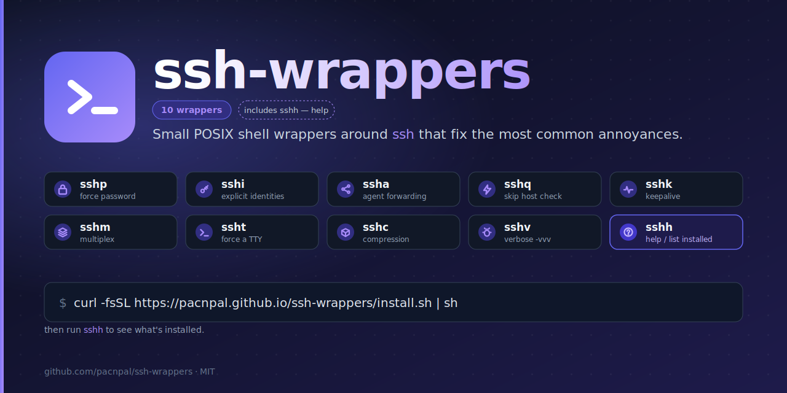

<p align="center">
  
</p>

<h1 align="center">ssh-wrappers</h1>

<p align="center">
  <a href="https://github.com/pacnpal/ssh-wrappers/actions/workflows/shellcheck.yml"></a>
  <a href="LICENSE"></a>
  
  
  <a href="https://github.com/pacnpal/ssh-wrappers/stargazers"></a>
  <a href="https://github.com/pacnpal/ssh-wrappers/commits/master"></a>
  
</p>

Ten small POSIX shell wrappers around `ssh` that fix the most common day-to-day annoyances. Each is a one-line tweak of `ssh` options, packaged behind a name short enough that you'll actually use it. Plus a built-in `sshh` to remind you which is which.

Homepage: <https://pacnpal.github.io/ssh-wrappers/>

## The wrappers

| Wrapper | Purpose | Mnemonic |
|---------|---------|----------|
| [`sshp`](sshp.md) | Force **p**assword authentication (disable pubkey for one connection) | **p**assword |
| [`sshi`](sshi.md) | Use only explicitly configured **i**dentities (`IdentitiesOnly=yes`) | **i**dentities |
| [`ssha`](ssha.md) | Forward your local ssh-**a**gent to the remote host (`-A`) | **a**gent |
| [`sshq`](sshq.md) | **Q**uiet/quick: skip host key prompts, don't pollute `known_hosts` | **q**uick |
| [`sshk`](sshk.md) | **K**eepalive: don't drop on idle (`ServerAlive*`) | **k**eepalive |
| [`sshm`](sshm.md) | **M**ultiplex: instant subsequent connections (`ControlMaster`) | **m**ultiplex |
| [`ssht`](ssht.md) | Force a pseudo-**t**erminal (`-t`) — for `sudo`, `htop`, `vim` over ssh | **t**ty |
| [`sshc`](sshc.md) | **C**ompression (`-C`) — wins on slow links and text-heavy streams | **c**ompression |
| [`sshv`](sshv.md) | **V**erbose debug (`-vvv`) — see exactly what `ssh` is trying | **v**erbose |
| [`sshh`](sshh.md) | **H**elp — list installed wrappers, what they do, how to use | **h**elp |

## Why?

`ssh` is configurable to a fault. Most of its sharp edges have a fix that's a single `-o option=value` away — but it's the kind of fix you have to remember exists, type correctly, and know when to apply.

These wrappers turn each fix into a one-character mnemonic:

- Agent has too many keys, server says `Too many authentication failures` → `sshi`.
- Need to type a password but `ssh` keeps offering keys instead → `sshp`.
- Connection dropped while you got coffee → `sshk`.
- Spinning up the same host's connection 50 times in a deploy script → `sshm`.
- Run `sudo` over ssh, get `sudo: a terminal is required` → `ssht`.
- Cloud VM with a fresh host key, don't want to litter `known_hosts` → `sshq`.
- Need agent forwarding for `git pull` on a bastion → `ssha`.
- Streaming logs over a slow link → `sshc`.
- Connection failing for an unknown reason → `sshv`.
- Forgot which wrapper does what → `sshh`.

## Install

### One-liner (everything)

```sh
curl -fsSL https://pacnpal.github.io/ssh-wrappers/install.sh | sh
```

### Selective install

Pass wrapper names as positional arguments to install only those:

```sh
# Just the auth helpers
curl -fsSL https://pacnpal.github.io/ssh-wrappers/install.sh | sh -s -- sshp sshi ssha

# Just connection management
curl -fsSL https://pacnpal.github.io/ssh-wrappers/install.sh | sh -s -- sshk sshm

# Single wrapper
curl -fsSL https://pacnpal.github.io/ssh-wrappers/install.sh | sh -s -- ssht
```

List the available names with `--list`:

```sh
curl -fsSL https://pacnpal.github.io/ssh-wrappers/install.sh | sh -s -- --list
```

### What the installer does

- auto-detects your shell from `$SHELL` (zsh, bash, ksh)
- writes the selected functions to the matching rc file (`~/.zshrc`, `~/.bash_profile` on macOS bash, `~/.bashrc` elsewhere, `~/.kshrc`, …) inside a marked block
- is idempotent — re-running does nothing if the managed block is already there
- **refuses** to silently shadow wrappers you've already defined yourself (use `--force` to install anyway)
- supports `--uninstall` to cleanly remove the managed block (and only the managed block)

### Override the target file

```sh
SSH_WRAPPERS_RC=~/.zprofile sh install.sh
```

### Replace an existing install with a different selection

```sh
curl -fsSL https://pacnpal.github.io/ssh-wrappers/install.sh | sh -s -- --force sshp sshi sshk sshm
```

`--force` removes the existing managed block and writes the new selection.

### Uninstall

```sh
curl -fsSL https://pacnpal.github.io/ssh-wrappers/install.sh | sh -s -- --uninstall
```

Removes only the marked block; anything else in your rc file is untouched.

### Fish

Not covered by the installer (different function syntax). Run the installer once to see the snippet you can paste into `~/.config/fish/config.fish`, or copy the bodies straight from the per-wrapper docs.

### Manual

Skip the installer entirely — copy the function definitions you want from the per-wrapper docs into your rc file. Each wrapper's `.md` shows its function definition at the top.

## Usage

Every wrapper accepts the same arguments as `ssh`:

```sh
sshp user@host                                  # password instead of keys
sshi -i ~/.ssh/work_ed25519 user@host           # only this key
ssha bastion                                    # forward agent
sshq ec2-user@10.0.0.42                         # ephemeral cloud VM
sshk prod-bastion 'tail -f /var/log/syslog'     # long idle session
sshm work-bastion                               # then re-run; instant
ssht user@host sudo systemctl restart nginx     # sudo over ssh
sshc remote-builder 'tail -f build.log'         # compression
sshv user@host                                  # debug auth failure
sshh                                            # show all wrappers + install status
sshh sshm                                       # detail for one wrapper
```

Read the per-wrapper docs for what each option actually does, security tradeoffs, and `~/.ssh/config` equivalents:

- [sshp](sshp.md) · [sshi](sshi.md) · [ssha](ssha.md) — auth
- [sshq](sshq.md) — trust
- [sshk](sshk.md) · [sshm](sshm.md) — connection lifetime
- [ssht](ssht.md) · [sshc](sshc.md) — I/O
- [sshv](sshv.md) — debugging
- [sshh](sshh.md) — help / introspection

## Requirements

- POSIX shell (`/bin/sh`) for the installer
- OpenSSH client (any version from the past decade — every option used here has been stable for years)
- Interactive shell of zsh, bash, or ksh for the wrappers (fish has its own snippet — see install)

No build step, no runtime dependencies beyond what comes with your OS.

## Troubleshooting

**`Too many authentication failures`** — your agent has more keys than the server's `MaxAuthTries` (default 6). Use [`sshi`](sshi.md) to offer only one specific key, or [`sshp`](sshp.md) to skip pubkey entirely.

**`Permission denied (publickey)` with `sshp`** — the server has `PasswordAuthentication no`. No client-side wrapper can fix this; the server must allow password auth.

**`sudo: a terminal is required` over ssh** — pass the command through [`ssht`](ssht.md) instead of plain `ssh`.

**`client_loop: send disconnect: Broken pipe` after idle** — use [`sshk`](sshk.md), or set `ServerAliveInterval 30` for `Host *` in `~/.ssh/config`.

**`sshp`/`sshi`/etc. "command not found" after install** — open a fresh shell, or `source ~/.zshrc`. Shell functions only exist in interactive shells that have sourced your rc file. Check `type sshp` in the new shell.

**Function overridden by an alias or another script in `PATH`** — shell functions take precedence over executables in interactive shells, but not in non-interactive scripts. `type sshp` reveals what's actually being invoked.

**Wrapper conflicts with one I already defined** — the installer refuses to silently shadow you. Either remove your existing definition, install only the wrappers that don't conflict, or pass `--force` to overwrite.

**Pages URL returns 404 or stale content** — the GitHub Pages CDN caches for ~10 min. Use the commit-pinned raw URL or `https://cdn.jsdelivr.net/gh/pacnpal/ssh-wrappers/install.sh` to bust the cache once.

## Development

Lint the installer locally:

```sh
shellcheck --shell=sh install.sh
```

CI runs the same on every push to `master` — see the badge above.

Project layout:

```
.
├── install.sh                # the installer (source of truth for function bodies)
├── README.md                 # this file
├── index.html                # GitHub Pages landing page
├── ssh{p,i,a,q,k,m,t,c,v,h}.md # per-wrapper docs
├── assets/
│   ├── logo.svg              # the mark
│   ├── logo.png              # rendered 512x512
│   ├── social-card.svg       # 1280x640 OG image
│   └── social-card.png       # rendered
└── .github/workflows/
    └── shellcheck.yml        # CI
```

## License

[MIT](LICENSE) © pacnpal
